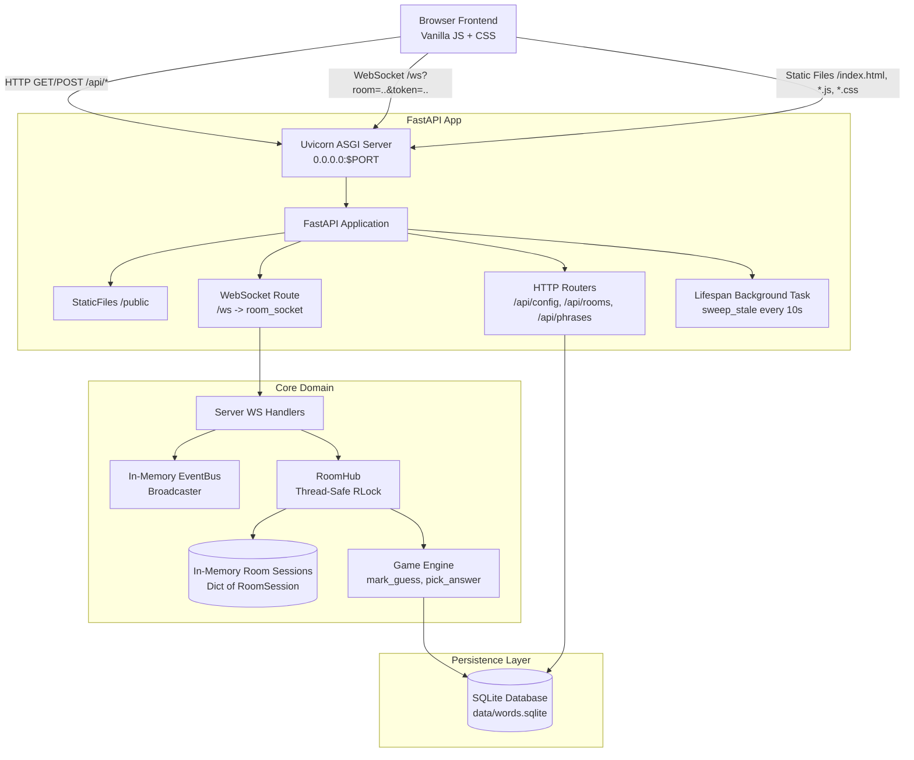
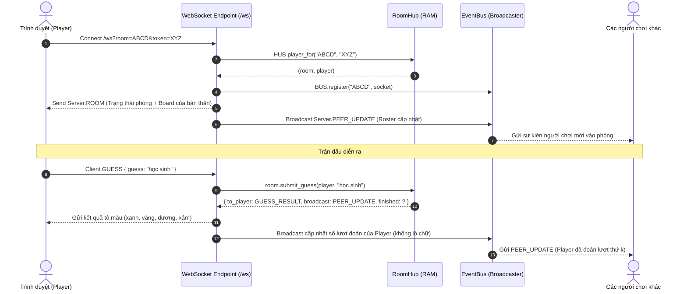

# Architecture Overview — Đoán Chữ Unlimited

Tài liệu này mô tả kiến trúc hiện tại của dự án **Đoán Chữ Unlimited** dựa trên mã nguồn thực tế tại nhánh `develop`.

---

## 1. System Overview (Tổng quan hệ thống)

**Đoán Chữ Unlimited** là ứng dụng web đoán cụm từ 2 từ tiếng Việt (cơ chế kiểu Wordle có dấu thanh), hỗ trợ:
1. **Chế độ Chơi đơn (Solo Play):** Chạy trực tiếp trên trình duyệt, gọi API lấy câu đố hoặc sử dụng engine tĩnh.
2. **Chế độ Phòng nhiều người (Multiplayer Room / Party Mode):** Kết nối WebSocket thời gian thực (`/ws`), mọi người trong phòng cùng giải một đề bài và đua thứ hạng.
3. **Kho từ vựng (Word Warehouse):** Quản trị kho từ vựng tiếng Việt lưu trữ bằng SQLite (`data/words.sqlite`) gồm 3 pool (`play`, `raw`, `rejected`).

### Mô hình triển khai (Deployment Architecture)

Ứng dụng chạy theo kiến trúc **Monolithic Single-Process**: Cả HTTP API, WebSocket Server và Static File Server đều chạy chung trong một tiến trình FastAPI/Uvicorn duy nhất.

---

## 2. Main Components & Modules

Hệ thống được chia thành 4 phân vùng chính:

| Thư mục / File | Mục đích & Trách nhiệm | Phụ thuộc |
| :--- | :--- | :--- |
| **`game/`** | **Domain Logic độc lập**: Chứa thuật toán phân tích dấu tiếng Việt, tô màu đoán chữ, quản lý phòng chơi và protocol. **Hoàn toàn độc lập với web framework (FastAPI/HTTP)**. | Python stdlib, `db.py` |
| **`server/`** | **Infrastructure & Transport**: FastAPI app, HTTP routes, WebSocket endpoint, live reload watcher, background worker dọn phòng rác. | `fastapi`, `uvicorn`, `game/`, `db.py` |
| **`play/`** & **`public/`** | **Frontend Client**: HTML/Vanilla JS/CSS. Giao diện chơi game, kết nối WS, bàn phím ảo, hiển thị bảng điểm. `public/` là thư mục bundle được build từ `play/`. | Trình duyệt chuẩn (ES6+) |
| **`data/`** & **`db.py`** | **Persistence & Kho từ vựng**: Quản lý SQLite database, phân loại từ ghép 2 từ, lọc từ thô tục, xuất artifact. | `sqlite3`, `paths.py` |

---

## 3. Data Flow & Request-Response Lifecycles

### A. Luồng HTTP API (Tạo phòng & Chơi đơn)

1. Client gửi `POST /api/rooms` kèm `{ "name": "Hải", "settings": {...} }`.
2. Router [`server/routes/rooms.py`](file:///d:/game_bruh/server/routes/rooms.py) gọi `HUB.create(...)`.
3. [`game/room.py`](file:///d:/game_bruh/game/room.py) sinh mã phòng 4 ký tự (`ABCD`), tạo token xác thực người chơi và khởi tạo `RoomSession` trong bộ nhớ RAM.
4. Trả về cho Client: `{ "room_id": "ABCD", "token": "...", "player_id": "..." }`.

### B. Luồng WebSocket Multiplayer

---

## 4. Key Abstractions (Các trừu tượng cốt lõi)

### 1. `RoomSession` & `Player` ([`game/room.py`](file:///d:/game_bruh/game/room.py))
- **`Player`**: Đại diện cho 1 người chơi trong phòng. Giữ `token` bí mật, số lượt đoán (`attempts`), trạng thái giải xong (`solved`), danh sách các lần đoán (`guesses`) và ma trận màu (`marks_list`).
- **`RoomSession`**: Đại diện 1 phiên phòng chơi. Giữ `id` (mã 4 ký tự), `host_id`, `answer` (đáp án bí mật), trạng thái (`lobby`, `playing`, `finished`), và danh sách `players`.

### 2. `RoomHub` ([`game/room.py`](file:///d:/game_bruh/game/room.py))
- Đóng vai trò in-memory repository quản lý toàn bộ phòng chơi.
- Sử dụng `threading.RLock()` để đảm bảo an toàn đa luồng (thread-safety) khi đọc/ghi state giữa các HTTP requests và WebSocket events.

### 3. `Broadcaster` / `BUS` ([`game/ws.py`](file:///d:/game_bruh/game/ws.py))
- Cơ chế Pub/Sub in-memory dựa trên `asyncio.Lock()`.
- Quản lý danh sách các active WebSocket connections theo từng mã `room_id`.
- Tự động dọn dẹp (unregister) các kết nối chết khi gửi tin thất bại.

### 4. `mark_guess` ([`game/engine.py`](file:///d:/game_bruh/game/engine.py))
- Thuật toán lõi so khớp đáp án:
  - **Xanh lá (green):** Đúng chữ + đúng dấu, đúng vị trí.
  - **Vàng (yellow):** Đúng chữ + đúng dấu, sai vị trí.
  - **Xanh dương (blue):** Cùng nguyên âm gốc (`a/á/à`), sai dấu thanh.
  - **Xám (gray):** Ký tự không xuất hiện trong từ.
- Mỗi ký tự trong đáp án chỉ được tiêu thụ 1 lần theo thứ tự ưu tiên: Xanh lá > Vàng > Xanh dương > Xám.

---

## 5. Entry Points & Runtime Boundaries

1. **CLI / Local Entry Point:** [`main.py`](file:///d:/game_bruh/main.py)
   - Lệnh: `uv run python main.py --serve --port 18765 --host 0.0.0.0`
   - Phân tích cờ dòng lệnh, gọi `serve_play()` hoặc các tác vụ kho từ.
2. **Server Launcher:** [`server/serve.py`](file:///d:/game_bruh/server/serve.py)
   - Tự động build file tĩnh `play/` thành `public/`.
   - Khởi chạy Uvicorn ASGI server trên host/port đã cấu hình.
   - Quản lý file watcher (nếu bật `--reload`) và Cloudflare Tunnel (nếu bật `--tunnel`).
3. **FastAPI Application:** [`server/app.py`](file:///d:/game_bruh/server/app.py)
   - Gắn kết toàn bộ router HTTP, WebSocket `/ws`, middleware `NoCacheStatic`, và static files mount `/`.
   - Chạy background task định kỳ 10s: `HUB.sweep_stale()` quét phòng không hoạt động.

---

## 6. Infrastructure & External Boundaries

- **Database:** SQLite 3 (`data/words.sqlite`), truy cập trực tiếp qua thư viện chuẩn `sqlite3`, không dùng ORM cồng kềnh.
- **Hosting Production:** Render Web Service (Free Tier) chạy Linux container.
- **Ephemeral Filesystem Constraint:** Trên Render Free, ổ đĩa là tạm thời. Dữ liệu phòng chơi nằm trong RAM (sẽ mất khi process restart). Dữ liệu SQLite được đóng gói cùng Git repository.

---

## 7. Known Issues / Architectural Debt (Hạn chế kiến trúc cần lưu ý)

1. **In-Memory Multiplayer State (Chưa scale đa instance):**
   - Hiện tại toàn bộ phòng và người chơi nằm trong RAM của 1 process duy nhất (`HUB`).
   - *Hệ quả:* Không thể chạy nhiều worker (`WEB_CONCURRENCY > 1`) hoặc scale out nhiều replica nếu không có tầng phân tán (Redis Pub/Sub hoặc SQLite shared state).
   - *Hiện trạng:* Phù hợp hoàn hảo cho nhu cầu chơi với bạn bè và hosting gói Free.
2. **Thiếu cơ chế Nhiều vòng (Multi-round Match) & Bảng điểm tích lũy:**
   - Phòng chơi hiện tại chỉ kết thúc sau 1 câu đố duy nhất, người chơi phải đợi nhau hoặc chủ phòng phải bấm Rematch. Cần mở rộng sang cơ chế Series (3-5-10 câu) tính tổng điểm.
3. **Console Encoding trên Windows CLI:**
   - Chạy `main.py --help` trên cmd/powershell cp1252 cần `PYTHONUTF8=1` để không bị lỗi ký tự Unicode tiếng Việt trong docstring.
