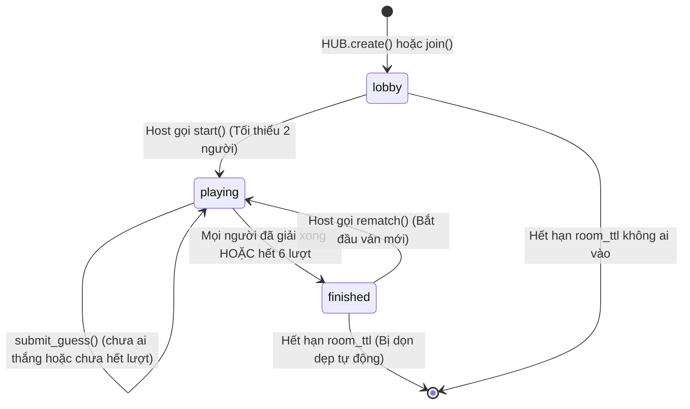

# Module: Room & Session Management (`game/room.py`, `game/limits.py`)

## 1. Mục đích (Purpose)
Quản lý vòng đời của các phòng chơi nhiều người (Party Mode), trạng thái người chơi, lượt đoán và kiểm soát trần tài nguyên bộ nhớ RAM.

---

## 2. Trách nhiệm (Responsibilities)
- Tạo phòng mới với mã code 4 ký tự ngẫu nhiên (chỉ dùng bảng chữ cái không gây nhầm lẫn: không có 0, 1, O, I).
- Quản lý phiên phòng: Host, danh sách người chơi (`Player`), trạng thái (`lobby`, `playing`, `finished`).
- Xử lý gửi lượt đoán (`submit_guess`), cập nhật tiến độ người chơi và kiểm tra điều kiện kết thúc ván.
- Kiểm soát trần máy chủ: Số lượng phòng tối đa (`max_rooms`), số người/phòng (`max_players`), tổng người chơi (`max_party`), dọn dẹp phòng idle quá hạn (`room_ttl`).

---

## 3. Cấu trúc State Machine

---

## 4. Giao diện công khai (Public Interfaces)
- **`RoomHub`**:
  - `create(name, settings) -> dict`: Tạo phòng mới, trả về token và mã phòng.
  - `join(room_id, name, token) -> dict`: Tham gia phòng mới hoặc tái kết nối phòng cũ với token đã lưu.
  - `player_for(room_id, token) -> (RoomSession, Player)`: Lấy thông tin phiên phòng và người chơi an toàn theo token.
  - `sweep_stale() -> list[(room_id, event)]`: Quét dọn các phòng và kết nối rác.
- **`RoomSession`**:
  - `start(player) -> dict`: Bắt đầu ván chơi (chỉ host được gọi).
  - `submit_guess(player, guess) -> dict`: Nộp từ đoán, trả về payload cho người đoán và payload broadcast cho bạn cùng phòng.
  - `rematch(player) -> dict`: Chơi lại ván mới cùng nhóm người chơi.

---

## 5. Quản lý đồng thời & Bất biến (Invariants)
- **Thread Safety:** Toàn bộ truy cập vào từ điển `_rooms` phải được bao bọc trong khối `with self._lock:` (sử dụng `threading.RLock()`).
- **Ẩn đáp án:** Phương thức `room.public(player)` chỉ đính kèm trường `solution` khi người chơi đó đã giải đúng (`solved = True`), hoặc đã dùng hết `MAX_ATTEMPTS` (6 lượt), hoặc phòng đã ở trạng thái `finished`.

---

## 6. Điểm mở rộng trong tương lai (Extension Points)
- **Chế độ nhiều vòng (Multi-round Match):** Bổ sung thuộc tính `round_current`, `round_total`, `scores: dict[player_id, int]` vào `RoomSession` để duy trì tổng điểm qua nhiều câu đố liên tiếp.
