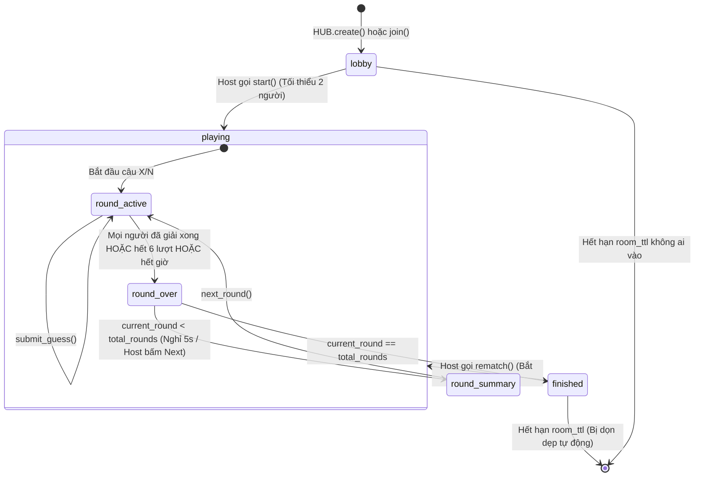

# Module: Room & Session Management (`game/room.py`, `game/limits.py`)

## 1. Mục đích (Purpose)
Quản lý vòng đời của các phòng chơi nhiều người (Party Mode), trạng thái người chơi, lượt đoán và kiểm soát trần tài nguyên bộ nhớ RAM.

---

## 2. Trách nhiệm (Responsibilities)
- Tạo phòng mới với mã code 4 ký tự ngẫu nhiên (chỉ dùng bảng chữ cái không gây nhầm lẫn: không có 0, 1, O, I).
- Quản lý phiên phòng: Host, danh sách người chơi (`Player`), trạng thái (`lobby`, `playing`, `finished`).
- Xử lý gửi lượt đoán (`submit_guess`), cập nhật tiến độ người chơi và kiểm tra điều kiện kết thúc ván.
- Kiểm soát trần máy chủ: Số lượng phòng tối đa (`max_rooms`), số người/phòng (`max_players`), tổng người chơi (`max_party`), dọn dẹp phòng idle quá hạn (`room_ttl`).

---

## 3. Cấu trúc State Machine

---

## 4. Giao diện công khai (Public Interfaces)
- **`RoomHub`**:
  - `create(name, settings) -> dict`: Tạo phòng mới (nhận `rounds`, `time_limit`), trả về token và mã phòng.
  - `join(room_id, name, token) -> dict`: Tham gia phòng mới hoặc tái kết nối:
    - Nếu có `token`: Khôi phục phiên chơi ngay lập tức (`disconnected = False`).
    - Nếu không có `token` (hoặc token bị xóa do đóng trình duyệt ẩn danh): Tự động kiểm tra người chơi đang "mất máy" (`disconnected = True`) trùng tên để re-claim vị trí mà không chặn người chơi cũ.
    - Nếu là người lạ khi ván đang chạy: Chặn với thông báo `Ván đang chạy`.
  - `player_for(room_id, token) -> (RoomSession, Player)`: Lấy thông tin phiên phòng và người chơi an toàn theo token.
  - `sweep_stale() -> list[(room_id, event)]`: Quét dọn phòng/kết nối rác và kiểm tra hết giờ `time_limit`.
- **`RoomSession`**:
  - `start(player) -> dict`: Bắt đầu trận đấu, reset điểm và thời gian, chuyển round 1.
  - `next_round(player) -> dict`: Chuyển sang câu tiếp theo, reset bảng chơi, giữ nguyên tổng điểm tích lũy.
  - `submit_guess(player, guess) -> dict`: Nộp từ đoán, tính điểm (100đ, 50đ, 40đ, 30đ, 20đ, 10đ), thời gian giải, và kích hoạt `ROUND_FINISHED` hoặc `FINISHED`.
  - `rematch(player) -> dict`: Bắt đầu trận đấu mới cùng nhóm người chơi.

---

## 5. Quản lý đồng thời & Bất biến (Invariants)
- **Thread Safety:** Toàn bộ truy cập vào từ điển `_rooms` phải được bao bọc trong khối `with self._lock:` (sử dụng `threading.RLock()`).
- **Ẩn đáp án:** Phương thức `room.public(player)` chỉ đính kèm trường `solution` khi người chơi đó đã giải đúng (`solved = True`), hoặc đã dùng hết `MAX_ATTEMPTS` (6 lượt), hoặc phòng đã ở trạng thái `round_summary` / `finished`.
- **Tie-breaker:** Khi tính `ranking()`, người có `total_score` cao hơn xếp trên; nếu bằng điểm, người có `total_time` thấp hơn (giải nhanh hơn) sẽ xếp trên.
